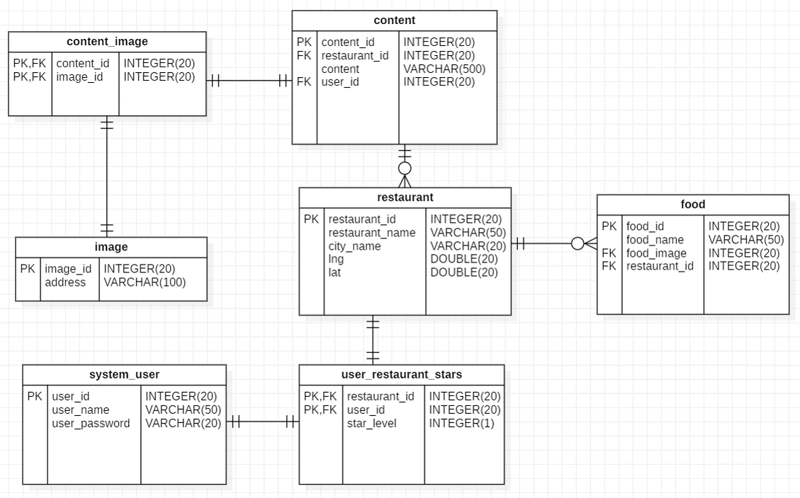
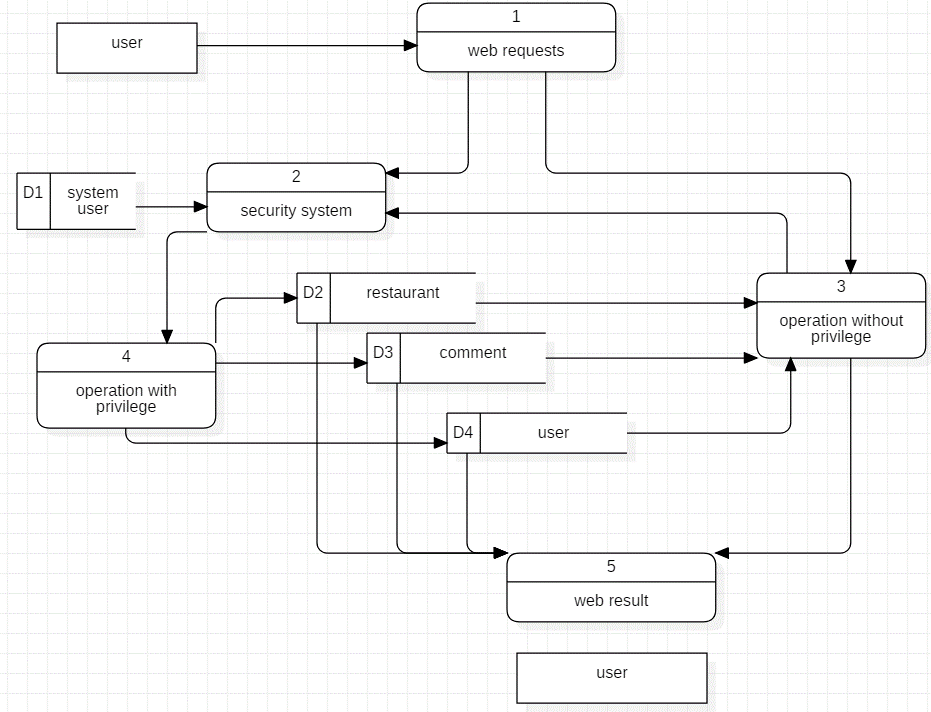
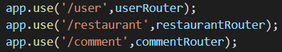
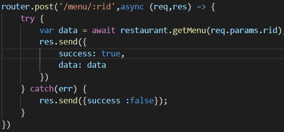
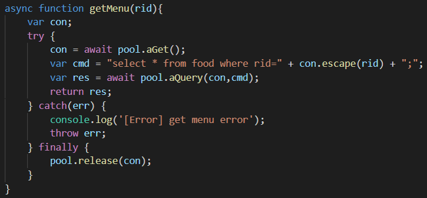

#FoodieSystem
##成员
- 1652666 徐仁和

##语言
- `Node.js`
- `vue.js` & `vuex.js`

##项目简述
通过观察生活，发现了下面三种需要：

1. 市场调查显示很多大学生上了外地的大学之后有心给家里亲戚带特产，但人生地不熟不知道当地特产是什么、去哪里买
2. 同学之间出去游玩之后就餐选择很少，基本都是烤肉火锅麻辣烫
3. 不少人对烹饪这门生活技能有兴趣，但不知道有哪些菜品可以学

根据以上的三个需要想到开发一个应用实行这些功能

## 目标功能
**--proposal--**

首要完成的功能有三个：

1. 根据用户输入的城市名称返回这个城市的特产信息及购买点地理位置，可以的话结合地图
2. 获取用户的位置并显示周边的美食餐厅，标注在地图上供用户选择
3. 用户可以在第二个功能获得美食餐厅的招牌菜名，输入菜名可以查询这道菜的制作菜谱

其他功能在这些功能完成后适当添加，比如用户的登录、注册、评论、打分

**--新增--**

这三个目标中，第一个功能没有现成api且信息集成有难度所以放弃。

第二个功能扩展为对地图上显示餐厅的各种操作，用户可以获取餐厅的详细信息，可以对某家餐厅进行评论。建立在数据库的基础上，如果地图上显示的餐厅数据库里没有，则可以在数据库中新建这个餐厅条目。由此也得到了一个内部的餐厅表

第三个功能改为依赖第二个功能结果上，在得到内部餐厅表之后可以对餐厅进行评论、增加菜品。然后可以在菜品选项上点击获得菜谱的搜索结果

除此之外实现了登录、注册、评论

##体系结构
- 总体架构

`web browser` <-> `express server` <-> `SQL call` <-> `SQL table`

`E-R diagram`:

- 环境框架

整体采用node.js环境，在这个环境里搭建后端express和前端vue、vuex框架

##数据流动

- web端获取用户请求，分为需要权限的和不需要权限的操作传到后端
- 对需要权限的操作获取用户登录信息以获取权限
	- 若有相应权限则对对应数据表进行操作
- 没有权限的用户只能从数据库获取一些数据，不能更改；可以通过登录注册转换为有权限的用户
- 操作完成结果返回web端显示给用户

##api集成
- 对于外部的api，调用`http-proxy-middleware`库来进行代理，以此发送跨域请求
- 对于后台数据库的api，将这些api按功能模块分为几类，各包含自己的sql call 调用数据库。功能模块提供这些操作函数，集成到模块的根目录，即每个模块给一个地址，模块里的功能api由此地址路由。前端来的http请求也是先依据根目录分到对应的模块，在根据后面的地址路由到其他具体函数。将数据库调用按模块集合成了一个接口

##程序执行
先运行`npmInstall.sh`安装必要的`node.js`环境，再运行`npmRun.sh`

